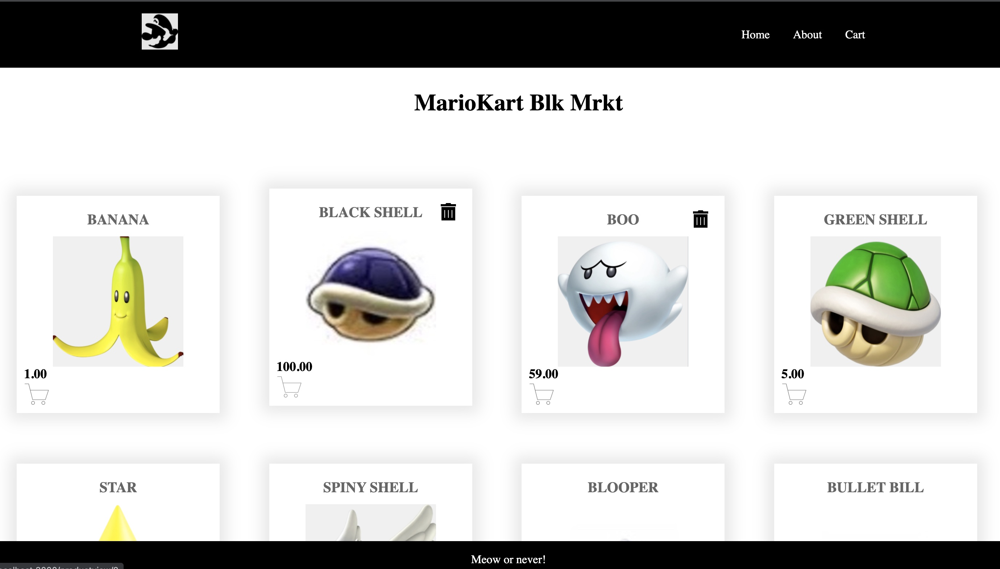
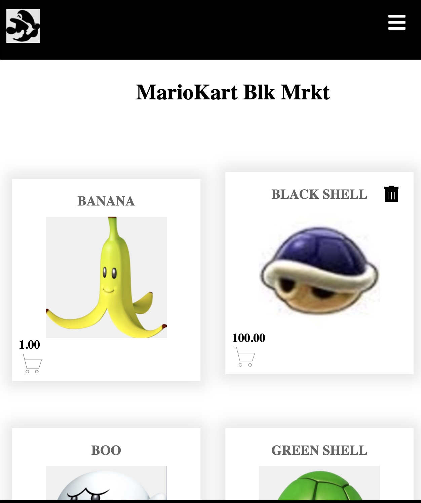

# Mario Kart Blk Mrkt

## Date: 2-6-2022

### By: Josh Rea

#### [LinkedIn](https://www.linkedin.com/in/joshua-rea/) | [GitHub](https://github.com/jdrea1587)

---

### **_Description_**

#### Your one stop shop for mario kart black market goods. Never get caught with your shells down again!

---

### **_Technologies Used_**

- HTML5
- CSS3
- Django
- PostgreSQL
- React
- Redux
- Python
- Express

---

### **_Getting Started_**

##### A Trello board was used to keep track of development progress and can be viewed here [here](https://trello.com/b/NG5P8qug/m-krt-mrkt)

##### The project itself was deployed and can be viewed [here](URL).

---

### **_Screenshots_**

##### image header 1

##### image header 2

### **_Future Updates_**

- [ ] Cart Price
- [ ] Search Categories
- [ ] User Authorization

**_Credits_**

#### GA Wiki: [GA](https://github.com/SEI-R-11-8/class_wiki)

#### CSS Tricks: [CSS-Tricks](https://css-tricks.com/snippets/css/complete-guide-grid)

#### Markdown Guide: [ia.net](https://ia.net/writer/support/general/markdown-guide)

#### Markdown Cheatsheet: [GitHub](https://guides.github.com/pdfs/markdown-cheatsheet-online.pdf)

#### W3Schools: [W3Schools](https://www.w3schools.com/)

#### Styling: [Youtube](https://www.youtube.com/watch?v=NJtTAlDxFWo)

#### Dev: [Article](https://dev.to/stephanieopala/simple-navigation-bar-in-react-js-4d5m)

#### Mario Kart Items: [Mario](https://mariokart.fandom.com/wiki/Item)

#### Stack: [Stack](https://stackoverflow.com/)
